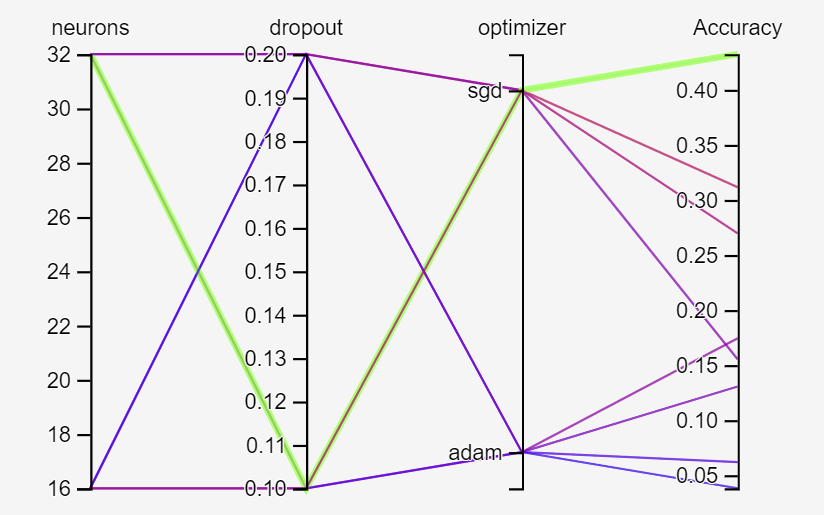
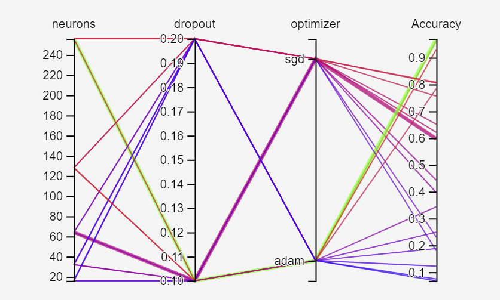
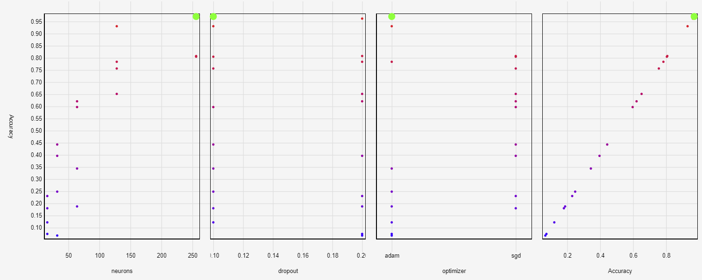
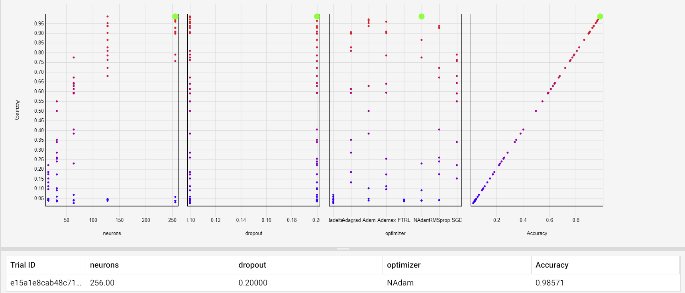
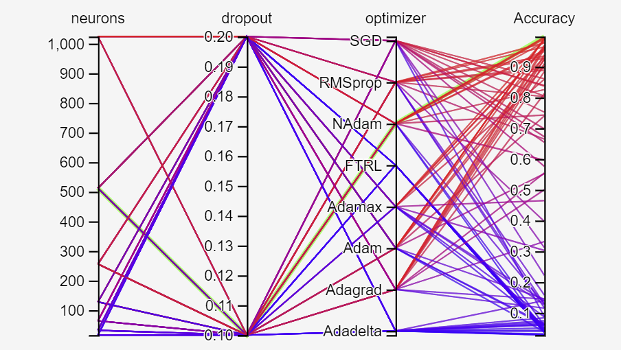
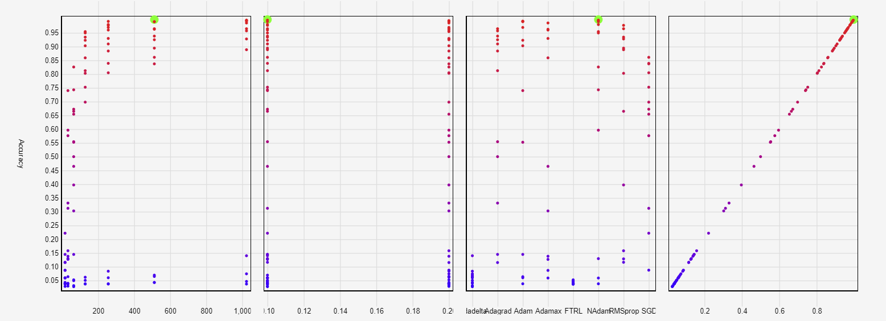
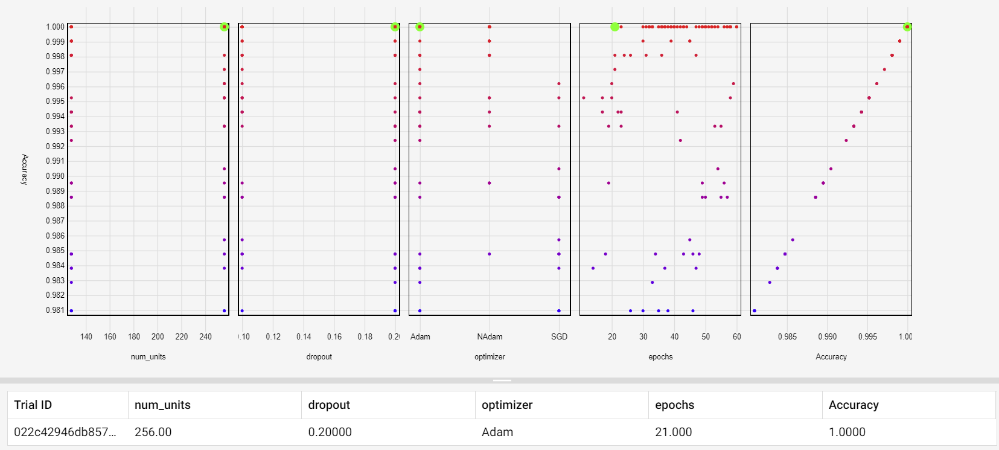

# Introduction
This report outlines the approach that I used when designing an optimisation strategy for an image classification artificial neuronal network where I attempted to get the highest efficiency possible. The challenge was to find the optimal structure.

When dealing with `Convolutional Neural Networks` the first layer has to be a `Flatten Layer` which collapses the spatial dimensions of the input, more precisely - in our scenario, it takes the images which come as two dimensional arrays and turns them into one-dimensional, and the last layer, also known as the output layer is composed of a Dense layer of 30 neurons since the classification problem has 30 possible outputs. Everything else that's in between those two layers may vary and it was my duty to find the most optimal network architecture. 

# Designing a Solution
"When building machine learning models there are various parameters such as the dropout rate in a layer or the learning rate. These decisions impact model metrics, such as accuracy. Therefore, an important step in machine learning workflow is to identify the best parameters of your problem, which often involves experimentation."

Tweaking one parameter at a time and re-evaluating the model for each change that has been made can be a little bit laborious, especially when you have to deal with numerous values and model optimizers. To automate this repetitive task, I followed the advice of Tensorflow and used one of their optimization strategies called `Hyperparameter Tuning`, which facilitated the process of benchmarking by allowing me first to pick which parameters I want to adjust and second to loop through all possible scenarios, where it would try building a model of all potential combinations within the parameters chosen. To keep track of all models, and their respective accuracy, loss and the parameters used when building them I used callbacks, which essentially logged all that information into a file which would later be used for analysis. 

For the `hidden layers`, which consists of all the layers that are held in between the first and last layer of the neuronal network, I decided to use a `Dense layer` - which is responsible to link all the neurons from the input layer to the output layer along with a `Dropout layer` with an intended purpose of preventing the model from overfitting. "Dropout is a regularization technique patented by Google for reducing overfitting in neural networks by preventing complex co-adaptations on training data. It is a very efficient way of performing model averaging with neural networks.". 

After analyzing the results it turned out that the highest accuracy was 0.43, which I considered unsatisfactory. So, therefore I decided to raise the number of neurons allocated to the dense layer and leaving the other parameters as they were.

As it can be seen in the attached graphs it appeared that only by increasing the number of neurons on the dense layer the accuracy grew exponentially. For future investigations and possible improvements, I appended the optimizers with all of the possible choices.

To my surprise, by using NAdam as an optimizer I could hit an accuracy of 0.98, but before calling it the final solution I wanted to give it another run with a neuronal threshold and a higher dropout interval.

For the final stage, 112 models were tested in which two of the results were models that used NAdam as the optimizer which hit an accuracy of 0.998 and 0.994 followed by Adam in third place which scored 0.990. 

A model overfits when the validation data would peak after training for several epochs and would stagnate or start decreasing in accuracy. 

This would happen when you feed the model too much data and starts memorising the patterns that don't generalize to the test data. To prevent this from happening I created a new Hyperparameter for epochs, where I experimented only with the optimizers that scored higher than 90 on our recent experiments (Adam, NAdam, SGD) within a range of 60 epochs. This experiment produced 1158 models, where only the ones who scored higher than 98% were evaluated to increase the readability of the graph.

As it can be seen in the graph above, the highlighted model achieved an accuracy of 100% using 256 neurons for the Dense layer, a dropout value of 0.2 and the Adam optimizer where only 21 epochs were needed. This model proved that once the neuronal networks passes the mark of 21 epochs the accuracy might or might not drop - overfitting. To conclude this, there's no point of additional optimization since perfection was already obtained.

# Conclusion
In the end, I would like to conclude that using Hyperparameter Tuning was proven to work out better than I could ever expect, where I would rather not imagine how I was to test all of those model variations manually. Tensorboard has proven to be quite a valuable tool when improving a given model, it provided me with multiple graphics and felt much friendlier that matplotlib. Last but not least, the Dropout optimisation made the models significantly lighter compared to the ones I ended up on my first assignment where I didn’t use it. 

The benchmark process was long and exhausting, especially for my GPU which had to generate models for all possible variations of the given parameters, which were in total 1158 and it took about 10 hours on my GTX 1070 to complete, but the results proved to be extraordinary. 
